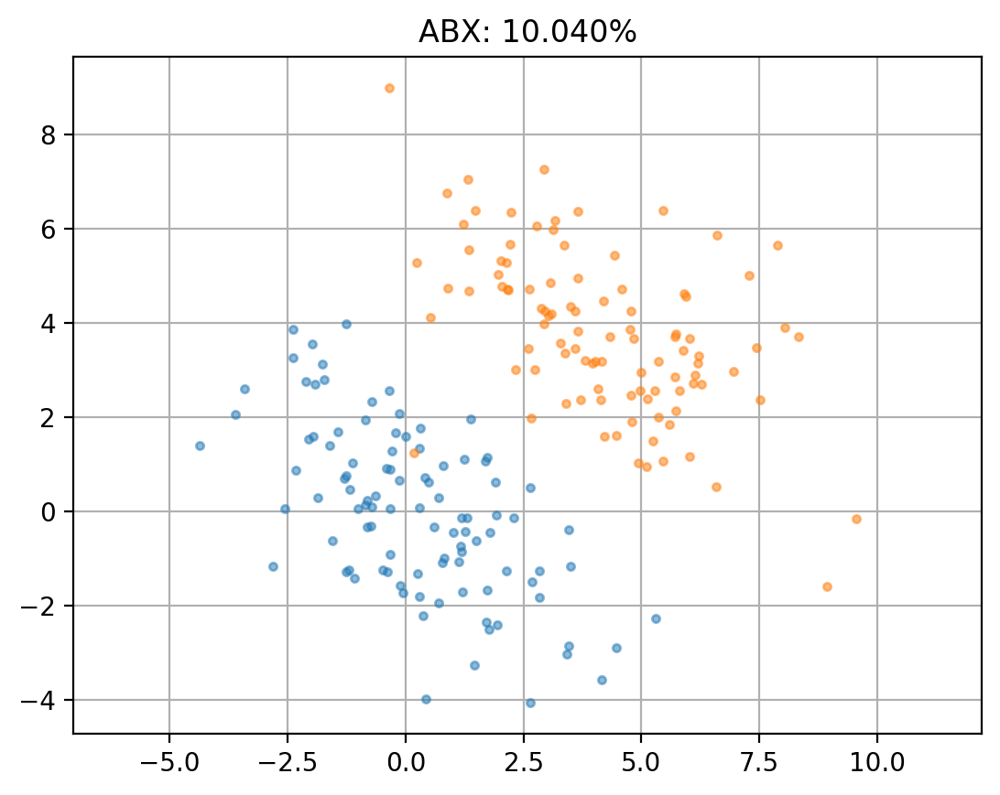
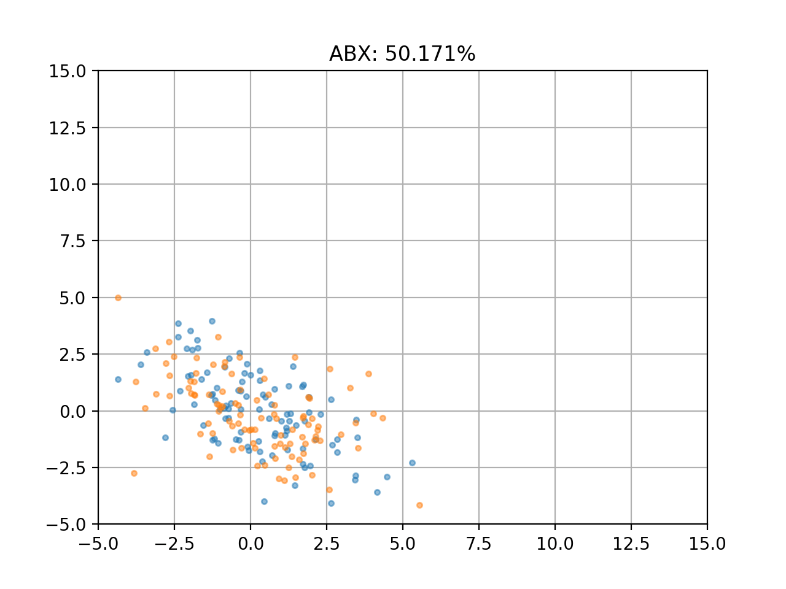

# Fast ABX

## Motivation

1. Simple and generic API
2. As fast as possible

This library aims to be as clear and minimal as possible to make its maintenance easy,
and the code readable and quick to understand. It should be easy to incorporate
different components into one's personal code, and not just use it as a black box.

At the same time, it must be as fast as possible to calculate the ABX, both in
forming triplets and calculating the distances themselves, while offering the
possibility to use any configuration of "on," "by," and "across" conditions.

The idea of creating yet again a new ABX library comes from the realization
that the [polars](https://github.com/pola-rs/polars) library efficiently and easily
solves the difficulties associated with creating triplets.

We can write the creation of the triplets as some "join" and "select" operations
on dataframes, then some "filter" for subsampling. With `polars`, the full query
is built lazily and then processed end-to-end. The backend will run several
optimizations for us, and can even run on GPU. We don't have to worry anymore
about how to built the triplets in a clever manner.

The computation of the distances is similar as
[libri-light-abx2](https://github.com/zerospeech/libri-light-abx2).
The important change is that now the DTW is computed in a PyTorch C++ extension,
with CPU (using OpenMP) and CUDA backends. The speedup is most noticeable on
large cells, such as those obtained when running the Phoneme ABX without
context conditions.

## Installation

The easiest way to get started is to use the pre-built package.

### Pre-built package

To install the package on Macos or Linux x86-64, download the corresponding pre-built
wheel in the Release page, and install it with `pip` in your environment with
Python 3.12.
The package will be published on PyPI soon. We will also add support for other
Python versions.

### Build from source

Download this repository and run:

```bash
CXX="g++" uv build --wheel
```

If you want to have CUDA support, you must have a CUDA runtime installed,
and `CUDA_HOME` environment variable set.

## Examples

### ZeroSpeech ABX task

#### Python

```py
import torch

from fastabx import Dataset, Score, Subsampler, Task

dataset = Dataset.from_item("./triphone-dev-clean.item", "./features/dev-clean", 50, torch.load)
task = Task(dataset, on="#phone", by=["next-phone", "prev-phone", "speaker"], subsampler=Subsampler())
score = Score(task, "cosine")
print(score.collapse(levels=[("next-phone", "prev-phone"), "speaker"]))
```

#### CLI

```bash
❯ fastabx --help
usage: fastabx [-h] [--frequency FREQUENCY] [--speaker {within,across}] [--context {within,any}]
           [--distance {euclidean,cosine,angular,kl,kl_symmetric,identical,null}]
           [--max-size-group MAX_SIZE_GROUP] [--max-x-across MAX_X_ACROSS]
           [--seed SEED]
           item features

ZeroSpeech ABX

positional arguments:
  item                  Path to the item file
  features              Path to the features directory

options:
  -h, --help            show this help message and exit
  --frequency FREQUENCY
                        Feature frequency (in Hz)
  --speaker {within,across}
  --context {within,any}
  --distance {euclidean,cosine,angular,kl,kl_symmetric,identical,null}
  --max-size-group MAX_SIZE_GROUP
                        Maximum size of a cell
  --max-x-across MAX_X_ACROSS
                        With 'across', maximum number of X given (A, B)
  --seed SEED
```

### ABX between two gaussians

```python
import matplotlib.pyplot as plt
import numpy as np

from fastabx import Dataset, Score, Task

n = 100
diagonal_shift = 4
mean = np.zeros(2)
cov = np.array([[4, -2], [-2, 3]])

rng = np.random.default_rng(seed=0)
first = rng.multivariate_normal(mean, cov, n)
second = rng.multivariate_normal(mean + np.ones(2) * diagonal_shift, cov, n)

dataset = Dataset.from_numpy(np.vstack([first, second]), {"label": [0] * n + [1] * n})
task = Task(dataset, on="label")
score = Score(task, "euclidean")

plt.plot(*first.T, ".", alpha=0.5)
plt.plot(*second.T, ".", alpha=0.5)
plt.axis("equal")
plt.grid()
plt.title(f"ABX: {score.collapse():.3%}")
plt.show()
```



#### ABX with increasing shift between the two gaussians


