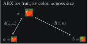
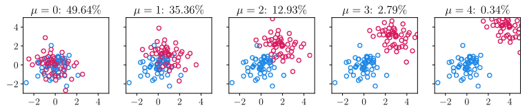
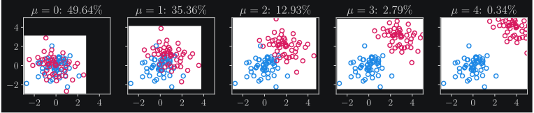

====================
ABX discriminability
====================

The ABX discriminability task is inspired by match-to-sample tasks used in human psychophysics,
and measures the discriminability between two categories. It is a zero-resource evaluation metric
that does not rely on training an additional probe. It measures what is directly extractable from
the representations. It is dimensionality-agnostic and works with dense or discrete representations.

The task is illustrated in the figure below. It measures how well categories of interest are separated
in the representation space by determining whether tokens from the same category are closer to each
other than to those from a different category.

The A, B, and X in the name ABX refer to the methodology. The discriminability of category :math:`A` from category
:math:`B` is the probability that a token :math:`x` of category :math:`A` is closer to another :math:`a \in A` than
to a token :math:`b \in B`. For example, to measure the discriminability of the phoneme /a/ from /e/, we construct
:math:`A` as the set of all the instances of /a/ in our corpus and :math:`B` as all instances of /e/.

Below is an example of the ABX task where the categories of to discriminate are the indices of the underlying
Gaussians. The Gaussians follow :math:`\mathcal{N}(\mathbf{0}, I)` and :math:`\mathcal{N}(\mathbf{\mu}, I)`.

In this initial formulation, categories have a single attribute: phoneme in our example. However, in many cases,
the input signal is characterized simultaneously by multiple attributes. In speech, for instance, the signal at a
given time window can be characterized both by the underlying phoneme being uttered and by additional factors such as
the surrounding context (previous and following phonemes), and by speaker’s identity. This additional information
can be used to build rich ABX tasks that test the extent to which discriminability remains robust despite variability
induced by one or several other categories.

We can therefore construct an ABX task specified by three conditions, illustrated in the table below:

.. list-table:: Example of valid triples for various ABX tasks.
   :widths: 70 10 10 10
   :header-rows: 1

   * - Task
     - :math:`a`
     - :math:`b`
     - :math:`x`
   * - ON fruit
     - 🍎
     - 🍋
     - 🍏
   * - ON color
     - 🍋‍🟩
     - 🍎
     - 🍐
   * - ON fruit, BY color
     - 🍎
     - 🍓
     - 🍎
   * - ON fruit, BY color, ACROSS count
     - 🍏
     - 🍐
     - 🍏🍏

We say that we measure the ABX discriminability ON the attribute that is identical between the A and X categories,
and that is different for B. We measure BY the attribute that remains the same for A, B and X.
Finally, when an attribute is the same for A and B but different for X, we say that the measure is ACROSS this attribute.
For example, in the standard ABX task that was used in the ZeroSpeech challenges, we measure the ABX discriminability on
phoneme, by context, and by or across speaker, using representations of triphones. With a slight abuse of notations:

- ON: :math:`a = x \neq b`
- BY: :math:`a = b = x`
- ACROSS: :math:`a = b \neq x`

We call "cell" the set of triples :math:`\mathcal{C} = A \times B \times X`. One example of a cell in the standard phoneme ABX task is the set of all
instances of /bag/ and /beg/ spoken by a given speaker. The comparison between tokens is performed using a distance :math:`d` on
the representations of :math:`a`, :math:`b` and :math:`x`. The test is successful if the representations of :math:`a` and :math:`x`
are closer than the representations of :math:`b` and :math:`x`. Formally, the ABX discriminability of a cell is

.. math::
    \mathcal{D}_\mathcal{C} = \frac{1}{|\mathcal{C}|} \sum_{(a, b, x) \in \mathcal{C}} (\mathbf{1}_{d(a, x) < d(b, x)} + \frac{1}{2} \mathbf{1}_{d(a, x) = d(b, x)}).

The overall ABX discriminability :math:`\mathcal{D}` is a weighted average across all cells.
The weighting function is a way to balance the effects of the asymmetries between cells and the differences in cell size.
What was done in the phoneme ABX task was to average first over contexts, then over the speaker identities,
and finally over phonemes. The library returns results in terms of ABX error rate :math:`1 − \mathcal{D}`.
